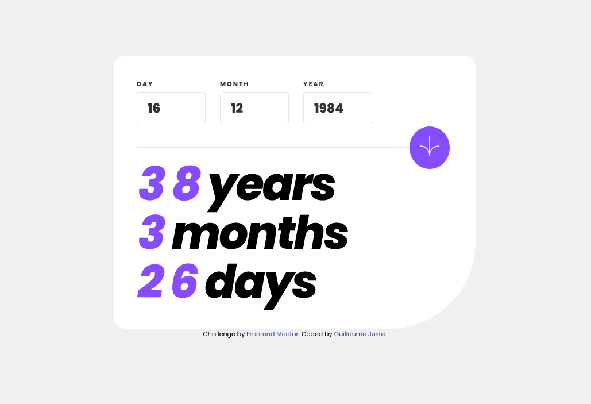

# Frontend Mentor - Age calculator app solution

This is a solution to the [Age calculator app challenge on Frontend Mentor](https://www.frontendmentor.io/challenges/age-calculator-app-dF9DFFpj-Q). Frontend Mentor challenges help you improve your coding skills by building realistic projects. 

## Table of contents

- [Overview](#overview)
  - [The challenge](#the-challenge)
  - [Screenshot](#screenshot)
  - [Links](#links)
- [My process](#my-process)
  - [Built with](#built-with)
  - [What I learned](#what-i-learned)
  - [Useful resources](#useful-resources)
- [Author](#author)
- [Acknowledgments](#acknowledgments)

## Overview

### The challenge

Users should be able to:

- View an age in years, months, and days after submitting a valid date through the form
- Receive validation errors if:
  - Any field is empty when the form is submitted
  - The day number is not between 1-31
  - The month number is not between 1-12
  - The year is in the future
  - The date is invalid e.g. 31/04/1991 (there are 30 days in April)
- View the optimal layout for the interface depending on their device's screen size
- See hover and focus states for all interactive elements on the page
- **Bonus**: See the age numbers animate to their final number when the form is submitted

### Screenshot

### Links

- Solution URL: [My codes](https://github.com/GuiPro0408/Age-Calculator)
- Live Website: [Live Demo](https://guillaume-age-calculator-0408.netlify.app/)

## My Process

During the development of this age calculator app, I followed a structured and organized approach to ensure the project's success. Below is a brief overview of my process:

### Planning and Design
- Analyzed the project requirements and established a clear understanding of the desired functionalities and features.
- Reviewed the provided design assets and determined the best way to implement the responsive layout.
- Outlined a plan for structuring the HTML, CSS, and JavaScript files.

### Development
- Set up the project structure with HTML, CSS, and JavaScript files.
- Implemented a mobile-first approach and developed the HTML structure with semantic markup.
- Styled the app using SASS custom properties and Flexbox for a responsive and visually appealing layout.
- Developed JavaScript functionality for form validation, age calculation, and user interface interactivity.

### Testing and Debugging
- Tested the app across different devices and browsers to ensure consistent user experience.
- Debugged and resolved any issues that arose during testing, refining the app's functionality and design.

### Refinement and Optimization
- Reviewed and optimized the code for readability, maintainability, and performance.
- Ensured that the app adhered to best practices in web development.

### Deployment
- Pushed the final version of the app to GitHub and shared the solution URL on Frontend Mentor.

Throughout the entire process, I focused on learning new techniques, refining my skills, and delivering a polished and functional age calculator app.

### Built with

- Semantic HTML5 markup
- SASS custom properties
- Flexbox
- Mobile-first workflow
- JavaScript

### What I learned

I learned how to use Js and JQuery to create this functionnality

To see how you can add code snippets, see below:

### Useful resources

- [JQuery](https://api.jquery.com/) - This helped me for to slect DOM Element more easily than with Vanilla JS reason. I really liked this pattern and will use it going forward.

## Author

- GitHub - [Guillaume Juste](https://github.com/GuiPro0408)
- Frontend Mentor - [@GuiPro0408](https://www.frontendmentor.io/profile/GuiPro0408)

## Acknowledgments

I would like to extend my gratitude to the following individuals and resources for their invaluable help and inspiration throughout the development of this project:

- [Frontend Mentor](https://www.frontendmentor.io/) for providing this engaging challenge, helping me improve my coding skills and learn new techniques.
- [Stack Overflow](https://stackoverflow.com/) community for their continuous support in addressing coding issues and providing solutions to various problems.
- [Mozilla Developer Network (MDN)](https://developer.mozilla.org/) for their comprehensive documentation on web technologies, which has been an indispensable resource throughout the development process.
